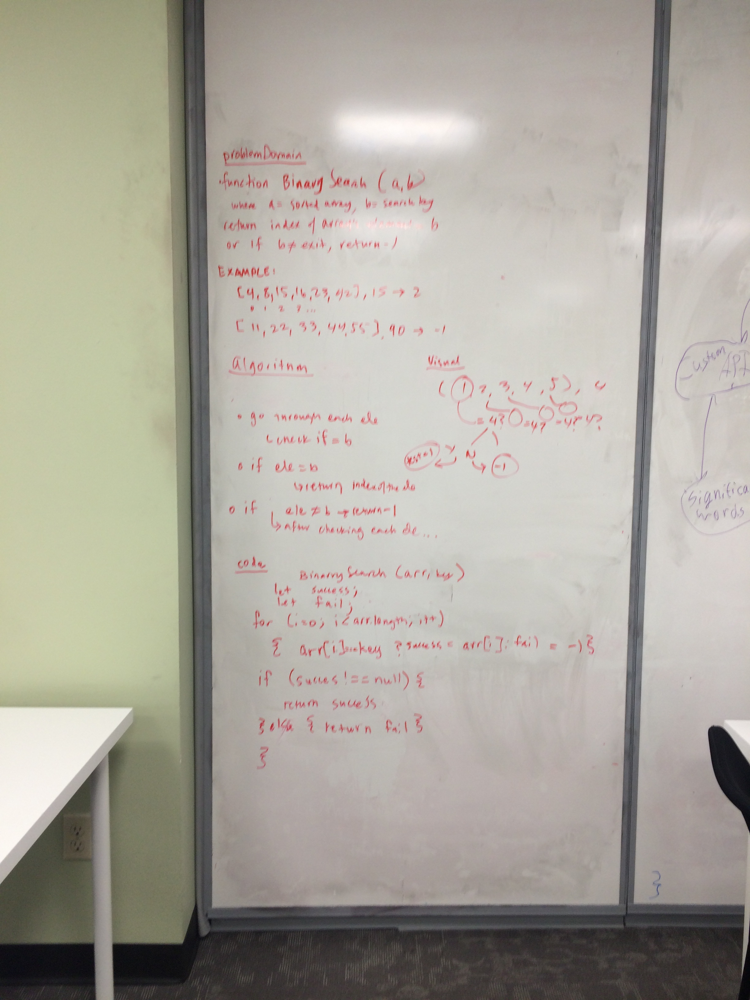

## Insert and shift middle index of array
Write a function called BinarySearch which takes in 2 parameters: a sorted array and the search key. Without utilizing any of the built-in methods available to your language, return the index of the array’s element that is equal to the search key, or -1 if the element does not exist.

examples: 
[4,8,15,16,23,42], 15 -> 15
[11,22,33,44,55,66,77], 90 -> -1

## Solution

Big O (N) because N = length of array, for loop runs for length of array

## Checklist
- [x] don't use built-in methods
- [x] write 3 tests using jest
- [x] ensure tests are passing

