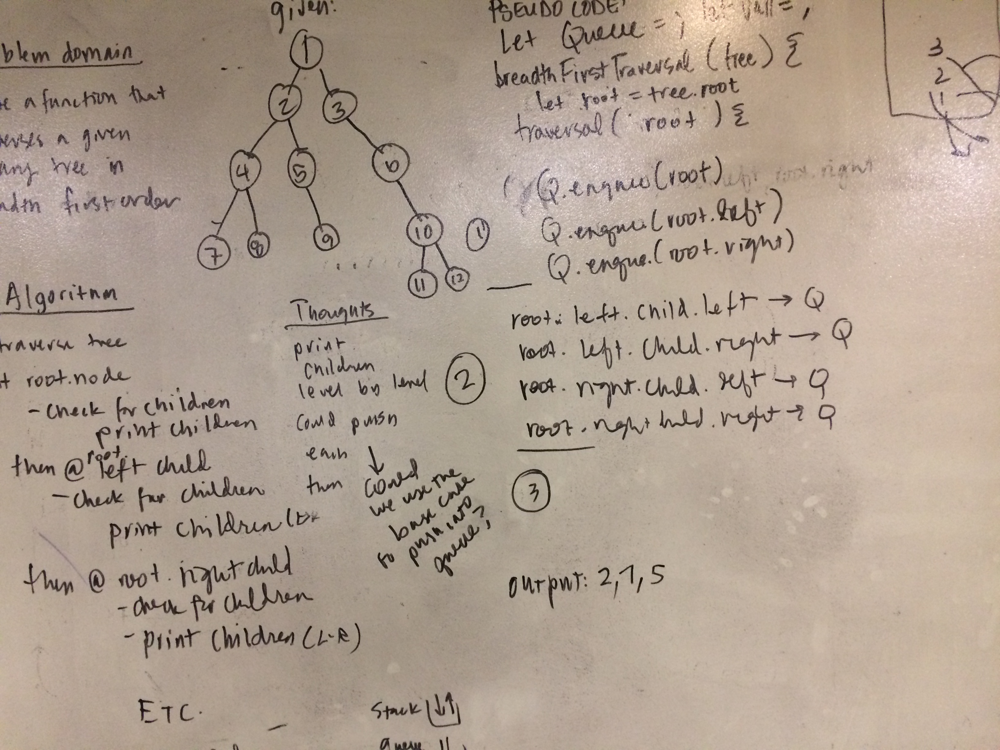

## Breadth First Traversal
Write a function called _breadthFirstTraversal_ which takes a Binary Tree as its unique input. Without utilizing any of the built-in methods available to your language, traverse the input tree using a Breadth-first approach; print every visited node’s value.

## Examples
given a tree:  ___1\_\_\_\_  
____________ 2 __ 3\_\_\_\_    
__________4__5 __\_6\_\_\_\_\_\_
the function should return: '123456'    

given a tree:  ___555\_\_\_\_  
_____________ 2 __ 3\_\_\_\_    
__________4__5 __\___68\_\_\_\_\_\_
the function should return: '555234568'    

## BigO
Assuming a queue implemented in the most efficient manner (using a linked list):
- _Time:_ O of N, where N is the height of the tree
- _Space:_ O of 1 -- in the sense that at no point would our queue ever exceed the input itself, in a binary tree the queue would at most, be 3 nodes at any given time 

## Solution

## Checklist
- [x] clean reusable code
- [x] write 3 tests using jest
- [x] ensure tests are passing
- [x] takes a tree as an argument

