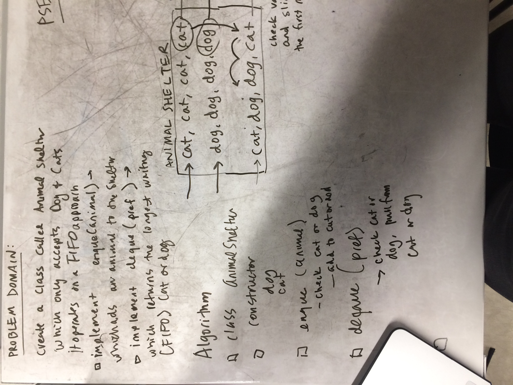
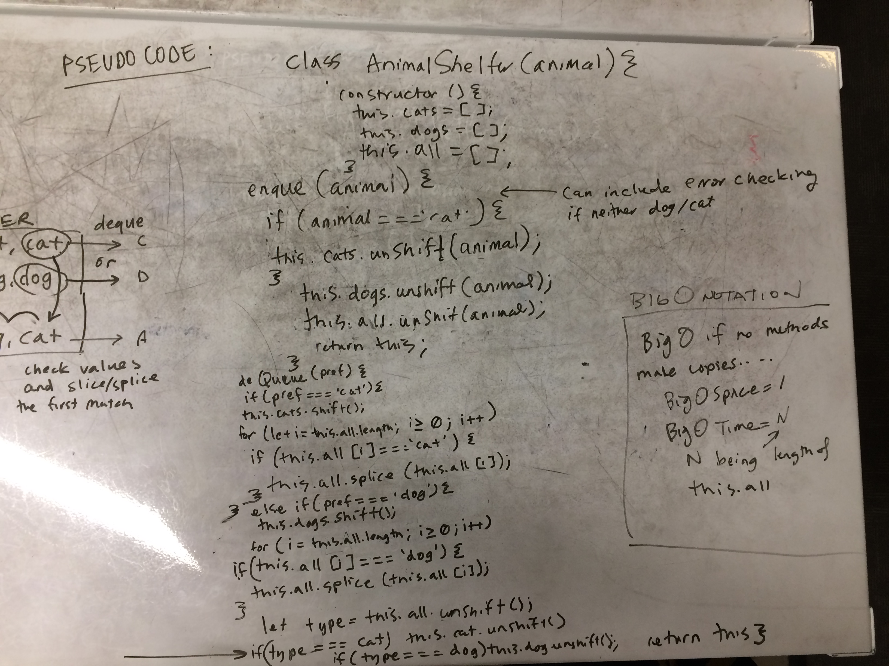

## FIFO Animal Shelter
Create a class called AnimalShelter which holds only dogs and cats. The shelter operates using a first-in, first-out approach.
__Implement the following methods:__
* enqueue(animal): adds animal to the shelter. animal can be either a dog or a cat object.
* dequeue(pref): returns either a dog or a cat. If pref, a string, is ‘cat’ return the longest-waiting cat. If pref is ‘dog’, return the longest-waiting dog. For anything else, return either a cat or a dog.

## Big O
- enqueue
    BigO of Space: 1 
    BigO of Time: 1? whatever Big O is of the array methods I used?
- dequeue
    BigO of Space: 1
    BigO if Time: 1? whatever the big O is of the array methods I used...?

## Solution

## Checklist
- [x] enque an animal adds an animal to the front of the animalShelter
- [x] deque an animal returns the longest waiting dog or cat
- [x] write 3 tests using jest
- [x] ensure tests are passing
- [x] Stretch Goal:
        If a cat or dog isn’t preferred, return whichever animal has been waiting in the shelter the longest.