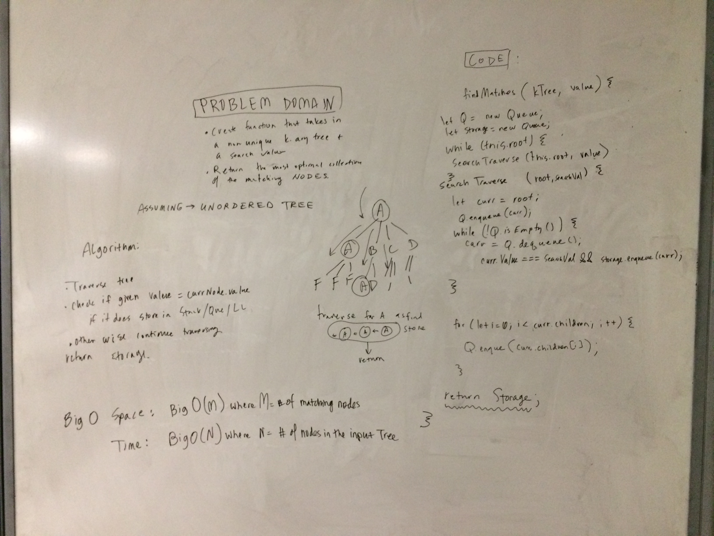

## Find Matches
Write a function that takes a k-ary tree with non-unique values and a target value.
Return a collection of all the nodes from within the tree that match the provided value.
Avoid utilizing any of the built-in methods available to your language.

## Examples
given a tree:  ___1\_\_\_\_  
____________ 3 __ 3\_\_\_\_    
__________4__5 __\_6\_\_\_\_\_\_
the function should return: 
a linked list of the 2 nodes with the value 3  

given a tree:  ___B\_\_\_\_  
_____________ 2 __ 3\_\_\_\_    
__________4__B __\___B\_\_\_\_\_\_
the function should return: 
a linked list of the 3 nodes with a value of B

## BigO
Assuming a queue implemented in the most efficient manner (using a linked list)
And the collection to return implimented as linked-list which inserts nodes in O(1) time and space

- _Time:_ O of N, where N is the number of nodes in the tree
- _Space:_ O of N where N represents the cost of traversal and so is the width or height of the tree, whichever is more significant, 

## Solution

## Checklist
- [x] clean reusable code
- [x] write 3 tests using jest
- [x] ensure tests are passing
- [x] takes a tree as an argument

