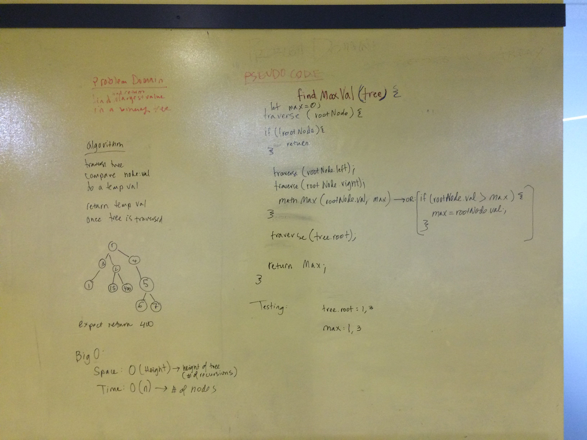

## Breadth First Traversal
Write a function called find-maximum-value which takes binary tree as its only imput. Without utilizing any of the built-in methods available to your language, return the maximum value stored in the tree. You can assume that the values stored in the Binary Tree will be numeric.

## Examples
given a tree:  ___1\_\_\_\_  
____________ 2 __ 3\_\_\_\_    
__________4__5 __\_6\_\_\_\_\_\_
the function should return: '6'    

given a tree:  ___555\_\_\_\_  
_____________ 2 __ 3\_\_\_\_    
__________4__5 __\___68\_\_\_\_\_\_
the function should return: '555'  

given a tree:  ___- 75\_\_\_\_  
_____________ 2 __ 3\_\_\_\_    
__________- 4__5 __\___68\_\_\_\_\_\_
the function should return: '68'   

## BigO
Assuming no negative numbers, assuming only numbers
- _Time:_ O of N, where N is the number of nodes in the tree
- _Space:_ O of H -- where H is the height or depth of the tree, ie how many times the funciton is recursed

## Solution

## Checklist
- [x] clean reusable code
- [x] write 3 tests using jest
- [x] ensure tests are passing
- [x] takes a binary tree as an argument

