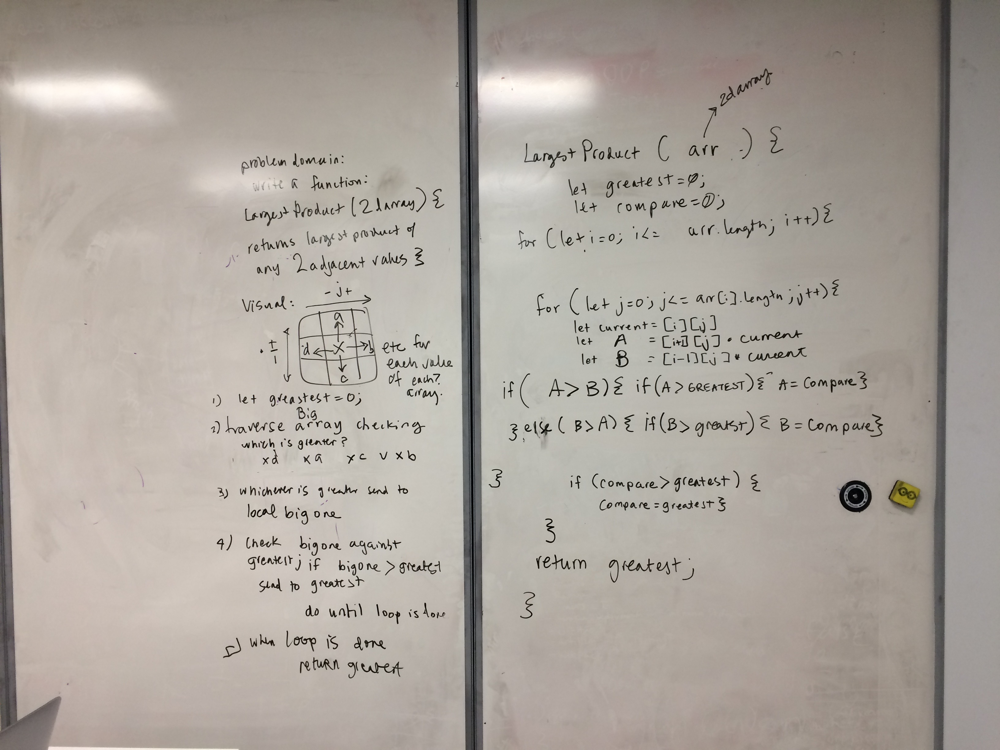

## Largest Product from 2D Array
Write a function called LargestProduct which takes in a 2D array. Without utilizing any of the built-in methods available to your language, return the largest product of 2 adjacent values within the 2D array.

examples: 
largestProduct([[1,2],[3,4],[5,6],[7,8]]) returns 56
largestProduct([[1,2,8],[3,4,8],[5,6,8],[7,8,8]]) returns 64
largestProduct([[1,2],[9,4],[9,6],[7,8]]) returns 81

## Solution

## Checklist
- [x] don't use built-in methods
- [x] write 3 tests using jest
- [] ensure tests are passing
