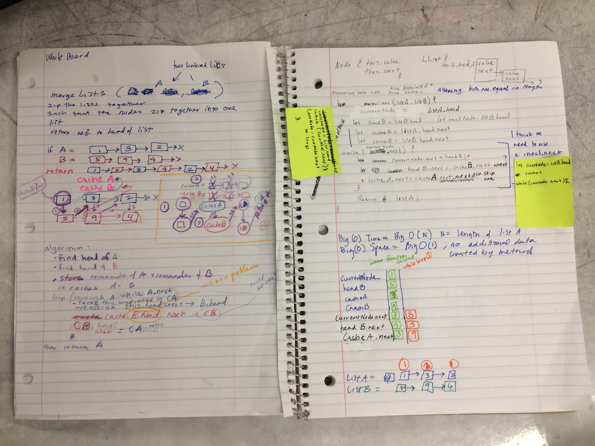

## Largest Product from 2D Array
Write a function called mergeLists which takes two linked lists as arguments. Zip the two linked lists together into one so that the nodes alternate between the two lists and return a reference to the head of the single list. Try and keep additional space down to O(1). You have access to the Node class and all the properties on the Linked List class as well as the methods created in previous challenges.

## Example 
- listA = 1->3->2->x
- listB = 5->9->4->x
- return listA =  1->5->3->9->2->4->x

- consider: lists of unmatched sizes

## Solution

## Checklist
- [] clean reusable code
- [] write 3 tests using jest
- [] ensure tests are passing
- 

