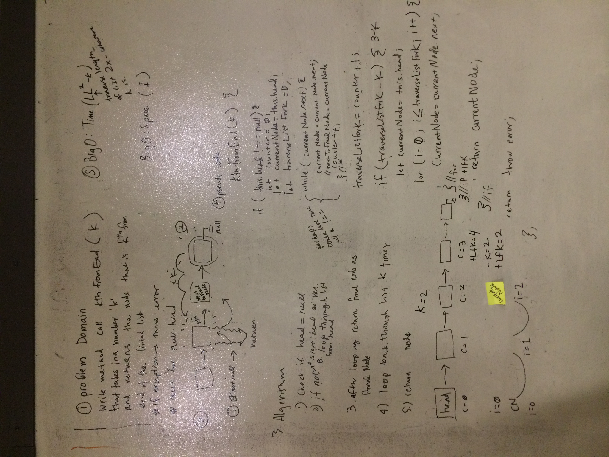

## Largest Product from 2D Array
Write a method for the Linked List class called kthFromEnd which takes a number, k, as an argument. Return the node that is k from the end of the linked list. You have access to the Node class and all the properties on the Linked List class as well as the methods created in previous challenges. ​

## Example 
- head->1->3->8->2->null k=0 returns 2->
- head -> 1->3->8->2->null k=2 returns 3->
- head -> 1->3->8->2->null k=6 returns exception/throw error

## Solution

## Checklist
- [x] clean reusable code
- [x] write 3 tests using jest
- [x] ensure tests are passing

## Stretch Goal
​ Once you’ve achieved a working solution, implement a method that finds the node at the middle of the Linked List. ​
