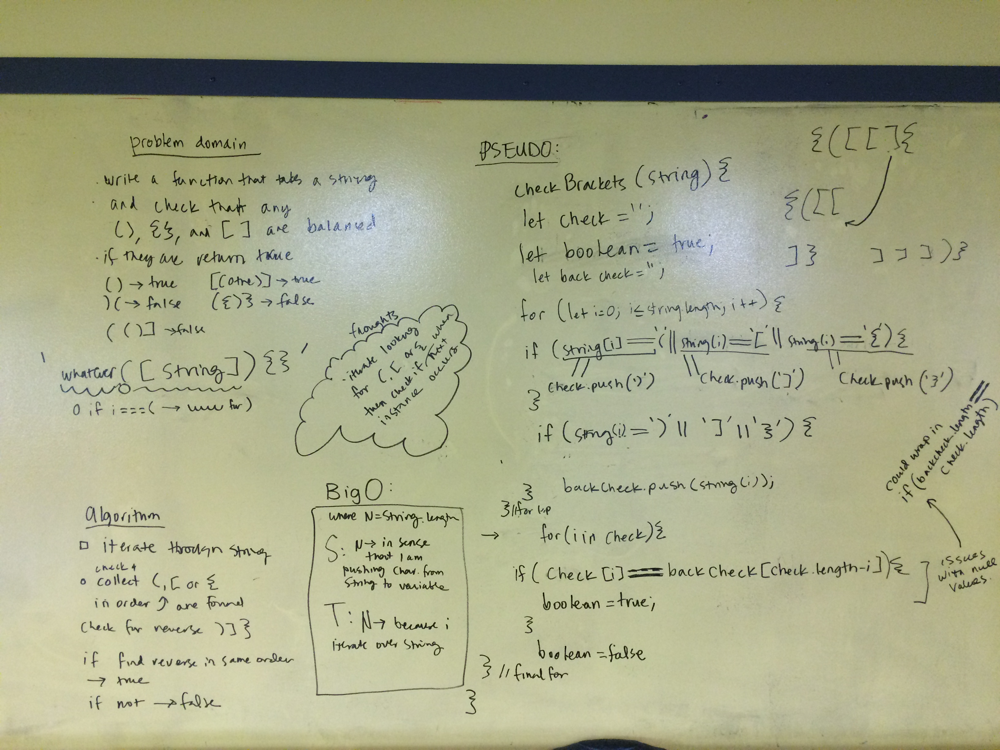

## Multi Bracket Validation
Your function should take a string as its only argument, and should return a boolean representing whether or not the brackets in the string are balanced. There are 3 types of brackets:

Round Brackets : ()
Square Brackets : []
Curly Brackets : {}

## Example 
- {}	TRUE
- {}(){}	TRUE
- ()[[Extra Characters]]	TRUE
- (){}[[]]	TRUE
- {}{Code}[Fellows](())	TRUE
- [({}]	FALSE
- (](	FALSE

## Solution

## Checklist
- [] clean reusable code
- [x] write 3 tests using jest
- [] ensure tests are passing
- 

