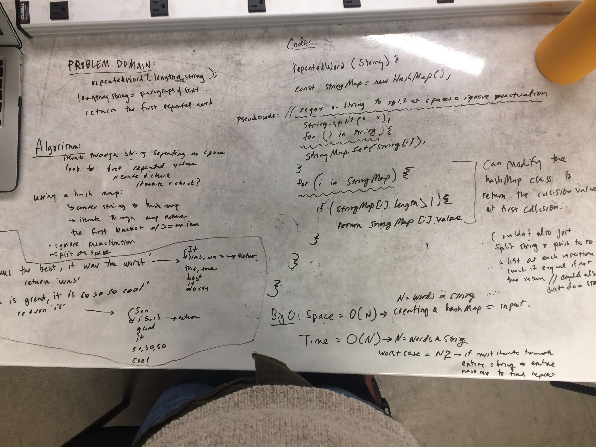

## Repeated Word
Write a function that accepts a lengthy string parameter.
Without utilizing any of the built-in library methods available to your language, return the first word to occur more than once in that provided string.

## Examples
"Once upon a time, there was a brave princess who..." expect	"a"
"It was a queer, sultry summer, the summer they electrocuted the Rosenbergs, and I didn’t know what I was doing in New York..." expect "summer"

## BigO
- _Time:_ O of N, where N the length of the string as its split converted to an array which is iterated over to push into a hashmap in worst case scenario this would be 2N, but we ignore constants, so N.
- _Space:_ O of N, where N is the length of the string-- the string is converted to a hashMap-- again worst case is most literally 2N, but we ignore constants, so N
## Solution

## Checklist
- [x] clean reusable code
- [ ] write 3 tests using jest
- [ ] ensure tests are passing
- [ ] takes a string as an argument

