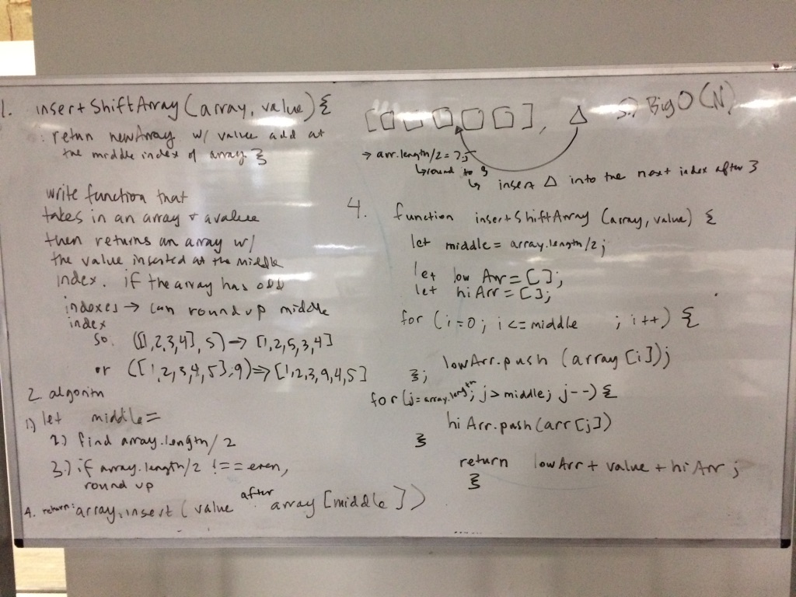

# Insert and shift middle index of array
given an array and a value, insert the value into the middle index of the array.
if the array is odd in length, then round up to find the "middle" index
so:
[1,2,3,value,4,5] or [1,2,value,3,4]

## Solution

